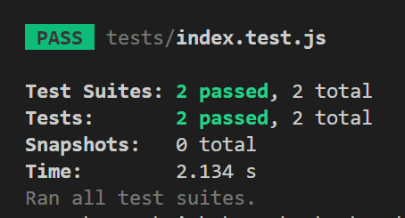

# Building A Socket IO Websocket Blockchain Server 
---

Blockchain is not just about cryptocurrency but the technology behind it. Utilizing the processes behind blockchain can help secure data. Let's take a look how!

[blockchain.js](https://github.com/Winston-Services/academy-lessons/blob/main/examples/code/javascript/blockchain.js)

In this example blockchain class we utilize many of the features of blockchain with out the use of a coin.

# Getting Started
---

To make things  a bit easier lets break this down in to some steps on what we want to achieve.

Step 1
We want to store information securely, and be able to access it anywhere.
-> Part A - Store the Information Securely
-> Part B - Access it anywhere.

Now to get started with that we need a server that can send and receive our messages. So, lets create a basic socket-io server to handle our interactions!
To do this we will need a few packages from NPM.

[pkg on NPM](https://www.npmjs.com/package/pkg)

`pkg` is a package that will enable us to compile our blockchain in to an application we can run on our local machines, and share with our friend.

[Socket-io on NPM](https://www.npmjs.com/package/socket.io)
You can look more into socket-io and how to use it to implement what ever you like, for now we are going to just create a basic server that will listen for and send out our commands.

[crypto-js on NPM](https://www.npmjs.com/package/crypto-js)
Crypto JS is the package we will use for hashing our transactions and blocks.

[Jest on NPM]()
Jest is used for building our Tests.

In my terminal I am going to open up the directory of my project and start a node project with `npm init`.

Then run the following commands :

```bash
npm i pkg
npm i socket-io
npm i crypto-js
npm i jest
```

Alright; now that all of those are installed. We can start writing the server code. 
I am going to open the `/server/index.js` file and write the code for the server interactions.

In the `index.js` file I am going to write the code for the command line interactions. Once compiled the application will be able to accept commands from the terminal, while running an instance of the blockchain.

To start though we should make sure our base class for the blockchain can pass some basic tests, right!

Building the tests will help us understand what is going on in the base classes before we utilize them.

## Unit Testing

Inside the subfolder `tests` we can create another folder called `base`. In this folder we will create our first test suite. I am going to open the file `blockchain.test.js` and create the basic tests for the Block an Blockchain classes.

In our file lets write our base test suite and a simple test case to make sure everything is working.

```JavaScript
describe("Base Blockchain Test Suite", () => {
  it("Can run this test.", () => {
    expect(true).toBe(true);
  });
});
```
Now each time we create a process with in our application we should create a test suite testing that it does what we intend for it to do. Test's should try to break the process, if the code is handled correctly the tests should pass.

So, lets get started with doing just that. We have already created the `/server/index.js` file but we need to create the `index.js` file for our client side interactions.

I am going to create the `index.js` file in the main folder, and a `index.test.js` in the tests folder so I can add a test suite for it as well.

```bash
npm run test
```



WoW, great progress so far! We are getting things setup, and we are ready to write tests to make sure everything is going to work as intended. 


### `index.js` file 

*    We need to be able to start the server
```JavaScript
const start = () => {};
```

*    We need to be able to stop the server
```JavaScript
const stop = () => {
  //do shut down stuff here.
  process.exit();
};
```

*    We need to be able to get information from the server
```JavaScript
const server = () => {};
```

*    We need to be able to update information for the server
```JavaScript
const update = () => {};
```

*    We need to be able to send a trx
```JavaScript
const send = () => {};
```

*    We need to be able to start our mining process
```JavaScript
const startMining = () => {};
```

*    We need to be able to stop our mining process
```JavaScript
const stopMining = () => {};
```

*    We need to be able to get information off the blockchain.

```JavaScript
const chain = () => {};
```

By now if you are new to programming you are probably overwhelmed with all of the new terms, applications, symbols, signs processes and procedures. It's okay most are when they first start out. It's part of the learning process. It may take a few times repeating the same lessons to remember and understand.

### `/server/index.js` file 

*   say hello
```JavaScript
const sayHello = () => {}; 
```
Let's tell everyone connected a client has connected, and we should periodically let others know we are available on the network.

*   add a trx to the local trx pool
```JavaScript
const send = (type, payload) => {}; 
```
*   get trx pool
```JavaScript
const trxPool = () => {}; 
```
*   get trx hash
```JavaScript
const trxHash = (trxHash) => {}; 
```
*   get block pool
```JavaScript
const blockPool = () => {};  
```
*   get block
```JavaScript
const block = (blockId) => {};
```
*   get block by hash
```JavaScript
const blockHash = (hash) => {};
```

*   mineABlock
```JavaScript
const mineBlock = () => {};
```

*   submit trx to network
```JavaScript
const submitTrx = (signedTransaction) => {};
```

*   receive trx from network
```JavaScript
const receive = (trx) => {};
```
*   vote
```JavaScript
const vote = (submitedProposal) => {};   
```
*   proposal
```JavaScript
const proposal = (submitedProposal) => {};
```

Alright now that we have some fundamentals sudo coded out we are able to start working step by step to acheive those tasks.

A Quick note : I am not handling error's or other 1 off's yet. Nor am I focues on writing the core to the blockchain. First I have to get the server setup and ready to communicate.

With what we have now we can write some code in our test cases to make sure our server and client will communicate as we would like them to. Before we can write those test however we need to write the code for the basic server and client interactions.

If we review the documentation for the socket-io server we can see that to start the server all we need is a very little bit of code.

```JavaScript
const { Server } = require("socket.io");

const io = new Server(3000, { 
    /* options */ // Read the documentation for more information.
    // https://socket.io/docs
});

io.on("connection", (socket) => {
    // Our code will go here.
});
```

Now that we have the basic server ready, and some sudo function for our application we need to write the test suites for what we have created. This will allow us to keep things running smoothly later.

